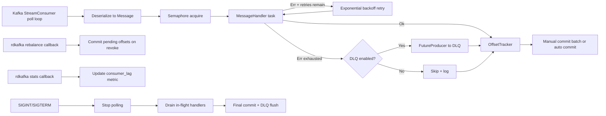

# kafka-rs-consumer

`kafka-rs-consumer` is a production-oriented Kafka consumer framework in Rust built on [`rdkafka`](https://crates.io/crates/rdkafka). It encapsulates consumer-group boilerplate, retries, backpressure, DLQ handling, offset commits, health checks, and graceful shutdown, while letting you focus on business logic through a `MessageHandler` trait.

## What This Project Demonstrates

- High-throughput async message processing with Tokio
- Rust ↔ `librdkafka` integration via `rdkafka` FFI bindings
- Backpressure and concurrency limits with semaphores
- Retry + dead-letter queue (DLQ) production patterns
- Manual vs auto offset commit strategies (at-most-once vs at-least-once tradeoffs)
- Graceful shutdown with in-flight draining and final commits
- Structured observability via `tracing` + health endpoint + internal metrics

## Architecture



## Project Layout

```text
kafka-rs-consumer/
├── Cargo.toml
├── README.md
├── config.toml
├── docker-compose.yml
├── src/
│   ├── main.rs
│   ├── lib.rs
│   ├── config.rs
│   ├── consumer.rs
│   ├── handler.rs
│   ├── offset.rs
│   ├── dlq.rs
│   ├── backpressure.rs
│   ├── health.rs
│   ├── metrics.rs
│   ├── shutdown.rs
│   └── error.rs
├── examples/
│   ├── simple_consumer.rs
│   ├── json_processor.rs
│   └── batch_consumer.rs
├── tests/
│   ├── consumer_test.rs
│   ├── dlq_test.rs
│   ├── handler_test.rs
│   └── offset_test.rs
└── scripts/
    ├── produce_test_messages.sh
    └── check_lag.sh
```

## Quick Start

### 1. Start Kafka locally

```bash
docker compose up -d
```

### 2. Build the project

```bash
cargo build
```

### 3. Run the default consumer

```bash
cargo run -- --config config.toml
```

### 4. Produce sample messages

```bash
./scripts/produce_test_messages.sh events 1000
```

### 5. Check consumer lag

```bash
./scripts/check_lag.sh my-consumer-group
```

## Configuration Reference (`config.toml`)

```toml
[kafka]
brokers = "localhost:9092"
group_id = "my-consumer-group"
topics = ["events", "orders"]
auto_offset_reset = "earliest"
session_timeout_ms = 30000
max_poll_interval_ms = 300000
statistics_interval_ms = 30000

[consumer]
concurrency = 4
commit_strategy = "auto"          # auto | manual
auto_commit_interval_ms = 5000
manual_commit_batch_size = 1       # only for manual strategy
max_retries = 3
retry_backoff_ms = 1000
shutdown_timeout_secs = 30
infrastructure_retry_backoff_ms = 2000

[dlq]
enabled = true
topic = "my-consumer-group.dlq"
include_metadata = true
flush_timeout_ms = 10000

[health]
enabled = true
bind_address = "0.0.0.0:9090"
max_poll_gap_secs = 60
max_rebalance_secs = 120
```

## MessageHandler API

```rust
#[async_trait]
pub trait MessageHandler: Send + Sync + 'static {
    type Error: std::error::Error + Send + Sync + 'static;
    async fn handle(&self, message: Message) -> Result<(), Self::Error>;
}
```

`Message` contains key, payload, topic, partition, offset, timestamp, and headers.

### JSON Convenience API

```rust
#[async_trait]
pub trait JsonHandler<T: DeserializeOwned>: Send + Sync + 'static {
    type Error: std::error::Error + Send + Sync + 'static;

    async fn handle(
        &self,
        key: Option<Vec<u8>>,
        value: T,
        metadata: MessageMetadata,
    ) -> Result<(), Self::Error>;
}
```

Use `JsonMessageHandlerAdapter` to wrap a `JsonHandler<T>` into a regular `MessageHandler`.

## Health Endpoint

When enabled, `GET /health` returns:

- `200` with `{"status":"ok",...}` when healthy
- `503` with `{"status":"unhealthy","reason":"..."}` when:
  - poll gap exceeds `max_poll_gap_secs`
  - rebalance duration exceeds `max_rebalance_secs`

Response includes `last_poll_secs_ago`, `in_flight`, and `messages_processed`.

## Metrics Tracked

- `messages_processed`
- `messages_failed`
- `messages_dlq`
- `processing_latency_ms_avg`
- `consumer_lag` (from `rdkafka` stats callback)
- `in_flight_handlers`

## Examples

```bash
cargo run --example simple_consumer -- --config config.toml
cargo run --example json_processor -- --config config.toml
cargo run --example batch_consumer -- --config config.toml --batch-size 100
```

## Testing

### Unit tests

```bash
cargo test --test handler_test
cargo test --test offset_test
cargo test --test dlq_test
```

### Kafka integration tests

Integration tests in `tests/consumer_test.rs` are marked `ignore` and require Kafka.

```bash
docker compose up -d
cargo test --test consumer_test -- --ignored
```

## Design Notes

- `auto` commit strategy: simpler, higher throughput, weaker delivery guarantees.
- `manual` commit strategy: commits only after successful processing (or deliberate skip/DLQ), enabling at-least-once processing.
- On partition revocation, pending tracked offsets are committed before losing ownership.
- On shutdown, polling stops first, in-flight handlers are drained with timeout, final offsets are committed, and DLQ producer is flushed.
